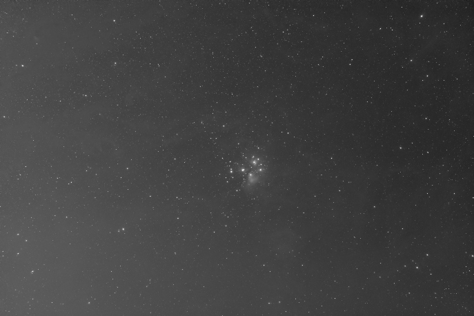
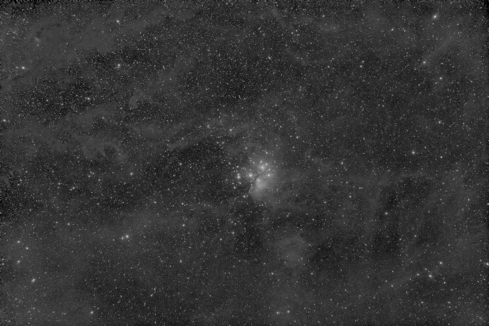

# bgoptimizer

Astrophotography **background modeling** (and subtraction) via spline gradient descent optimization. 

More info about this approach in the [blog page](https://expandingastro.blogspot.com/2022/02/background-modeling-via-spline-gradient.html). 

This tools requires python 3.8+, tensorflow 2 (GPU recommended), tensorflow_addons, numpy, skimage and [xisf](https://github.com/sergio-dr/xisf) packages. 

**Please cite this repo** if you use this code or some derivative to produce images to be published: "*Background modeling based on [bgoptimizer](https://github.com/sergio-dr/bgoptimizer) tool by Sergio Díaz*".

Example input:



Example output:



Animation of the optimization process:

 

# Usage
```
usage: bgoptimizer.py [-h] [-dx DOWNSCALING_FACTOR] [-df DOWNSCALING_FUNC] [-dq DELINEARIZATION_QUANTILE] [-p] [-N N]
                      [-O O] [-tm THRESHOLD_MIN] [-tM THRESHOLD_MAX] [-m MASK] [-i INITIALIZER] [-e EPOCHS] [-a ALPHA]
                      [-B B] [-lr LR]
                      input_file [output_path]
```

Generates a spline based background model (by gradient descent optimization) for the input (linear) image. Both the
background-subtracted image and background model are written to the specified output directory (appending
'_bgSubtracted' and 'bgModel' suffixes to the original filename). A mask can be specified by providing a grayscale
mask image, or by providing a (min, max) threshold range (outside this range, pixels are masked). Fully masked pixels
are ignored during optimization, so masks are helpful, e.g., for ignorig missing values after registration, or very
bright regions, when fitting the spline. Only XISF files are supported.

```
positional arguments:
  input_file            Input filename. Must be in XISF format, in linear state
  output_path           Path for the output files (by default, the current directory) (default: .)

optional arguments:
  -h, --help            show this help message and exit
  -dx DOWNSCALING_FACTOR, --downscaling-factor DOWNSCALING_FACTOR
                        Image downscaling factor for spline fitting (default: 8)
  -df DOWNSCALING_FUNC, --downscaling-func DOWNSCALING_FUNC
                        Image downscaling function ('median', 'mean') for spline fitting (default: median)
  -dq DELINEARIZATION_QUANTILE, --delinearization-quantile DELINEARIZATION_QUANTILE
                        Quantile mapped to 1.0 in image delinearization (default: 0.95)
  -p, --preview         Don't fit the spline, just preview delinearization and masking (default: False)
  -N N                  Number of control points of the spline (default: 32)
  -O O                  Order of the spline (2=thin-plate; 3=bicubic) (default: 2)
  -tm THRESHOLD_MIN, --threshold-min THRESHOLD_MIN
                        A mask can be defined by giving a (min, max) range (default: 0.001)
  -tM THRESHOLD_MAX, --threshold-max THRESHOLD_MAX
                        A mask can be defined by giving a (min, max) range (default: 1.0)
  -m MASK, --mask MASK  Path to a mask file (grayscale) (default: None)
  -i INITIALIZER, --initializer INITIALIZER
                        The spline fitting could be initialized with 'random' train points, or arranging them in a
                        'grid' (default: random)
  -e EPOCHS, --epochs EPOCHS
                        Maximum number of epochs (iterations) for the optimization process (default: 1000)
  -a ALPHA, --alpha ALPHA
                        [Advanced] Factor that multiplies the 'negative background' and 'overshoot' penalties in the
                        loss function (default: 5)
  -B B                  [Advanced] Batch size for the optimization process (default: 1)
  -lr LR                [Advanced] Learning rate for the optimization process (default: 0.001)
```

## Usage guidelines

1. As the background model is expected to be smooth, the optimization process is executed on a downscaled version on the input image, for performance. For very large or very small images you may want to change the `--downscaling-factor` value. 
1. You should stretch the data to reveal the background using the `--preview` mode. In this step you will want to fine tune the `--delinearization-quantile` value, that controls the amount of stretch (lower values imply more stretching). Don't worry about the highlights as long as you don't blown out the brightest parts of the background gradient. Example:
    ```
    bgoptimizer.py input.xisf -dq 0.9 -p
    ```
1. Check if you want to mask out too dim or too bright features. Fully masked pixels will be ignored by the optimizer. This may help if there are "black borders" resulting from registration, or if the data contains missing values (typically mapped to zero), or if bright nebulosity is present. In many cases, simply providing `--threshold-max` and `--threshold-min` values may be enough to get a decent mask. For example, in skyscapes, sometimes the foreground is darker than the sky, and it may simply masked out with `--threshold-min`. In other cases, you may want to create a more elaborated mask with another tool and provide it with the `--mask` option. This step should be also tried with the `--preview` mode. Example:
    ```
    bgoptimizer.py input.xisf -dq 0.9 -tM 0.75 -p
    ```
1. When you are happy with the delinearization and masking, its time to give a run to the optimization process. In this step you may want to fine tune the number of control points, `-N`, the initializer `--initializer` and the number or iterations or epochs, `--epochs`. The optimizer early stops when there is no further improvement, so the provided epochs value may not be reached. The default values of the rest of the parameters usually work well. Example:
    ```
    bgoptimizer.py input.xisf -dq 0.9 -tM 0.75 -N 64 -e 5000
    ```
